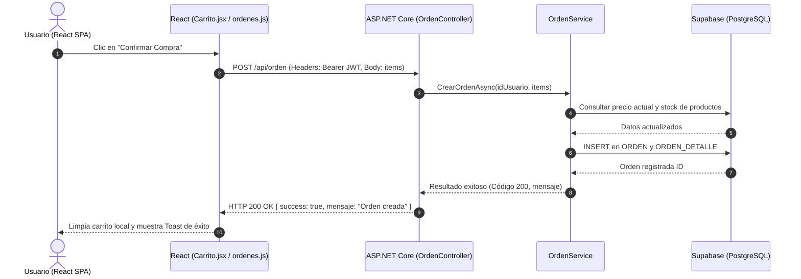

# Diagrama de Componentes y Comunicación

Este documento describe la arquitectura de componentes y la interacción entre el frontend en React y el backend en ASP.NET Core del sistema **Huellitas Vitales**. Para consultar los lineamientos generales del proyecto, véase [[Reglas-Generales]].

---

## 1. Visión General de Arquitectura y Comunicación

La comunicación entre la aplicación cliente y el servidor backend se realiza de manera asíncrona a través de una **API RESTful** sobre HTTP/HTTPS utilizando JSON como formato de intercambio de datos.

```
+-----------------------------------------------------------------------+
|                         NAVEGADOR (CLIENTE)                           |
|  +-----------------------------------------------------------------+  |
|  |                 React SPA (huellitas-frontend)                   |  |
|  |  [ React Pages / Components ] <-> [ Custom Hooks / API Fetch ] |  |
|  +-----------------------------------------------------------------+  |
+-----------------------------------||----------------------------------+
                                    || HTTP REST (JSON)
                                    || Auth: Bearer <JWT>
                                    \/
+-----------------------------------------------------------------------+
|                      SERVIDOR BACKEND (API REST)                      |
|  +-----------------------------------------------------------------+  |
|  |             ASP.NET Core API (HuellasVitalesAPI)                |  |
|  |                                                                 |  |
|  |  [ Controllers ] -> [ Services ] -> [ EF Core DbContext ]      |  |
|  +-----------------------------------------------------------------+  |
+-----------------------------------||----------------------------------+
                                    || Npgsql Driver
                                    \/
+-----------------------------------------------------------------------+
|                        BASE DE DATOS EN LA NUBE                       |
|  PostgreSQL (Supabase)                                                |
+-----------------------------------------------------------------------+
```

---

## 2. Mecanismo de Interacción y Autenticación

* **Base URL de la API:** Definida por la variable de entorno `VITE_API_URL` (ej. `http://localhost:5010/api`) y consumida desde `src/api/config.js`.
* **Seguridad y Tokens:**
  * La autenticación utiliza **JWT (JSON Web Token)**.
  * Al iniciar sesión o registrarse, el token es retornado y guardado en `localStorage` bajo la clave `token_huellitas`.
  * Las peticiones protegidas incluyen el encabezado HTTP:
    ```http
    Authorization: Bearer <token_huellitas>
    ```
* **CORS:** El backend posee la política de CORS `PermitirFrontend` en `Program.cs` permitiendo llamadas desde `http://localhost:5173` y los dominios de producción en Vercel.

---

## 3. Formato Estándar de Respuestas (JSON)

El backend responde consistentemente utilizando objetos JSON estandarizados para facilitar su procesamiento en los componentes de React.

### Respuesta de Éxito (HTTP 200 / 201)
```json
{
  "success": true,
  "mensaje": "Operación realizada con éxito.",
  "data": { ... }
}
```

### Respuesta de Error (HTTP 400 / 401 / 403 / 404 / 500)
```json
{
  "success": false,
  "mensaje": "Descripción legible del error en español."
}
```

---

## 4. Endpoints Consumidos por el Frontend

A continuación se detallan los principales endpoints organizados por módulo y su correspondiente controlador backend.

### Autenticación y Registro (`/api/login`)
* `POST /api/login/local` — Inicia sesión con correo y contraseña.
* `POST /api/login/registrar` — Registra un nuevo usuario cliente.
* `POST /api/login/google` — Autenticación rápida mediante Google OAuth.
* `POST /api/login/facebook` — Autenticación mediante Facebook.

### Usuarios y Perfil (`/api/usuario` y `/api/password`)
* `GET /api/usuario/{id}` — Obtiene la información detallada del perfil del usuario.
* `PUT /api/usuario/perfil` 🔒 — Actualiza los datos del perfil (requiere token).
* `POST /api/password/solicitar-recuperacion` — Envía solicitud de restablecimiento de contraseña.
* `POST /api/password/restablecer` — Confirma el cambio de contraseña con token.

### Comercio y Solicitudes (`/api/comercio`)
* `POST /api/comercio/solicitud` — Envía una solicitud para afiliar una veterinaria o comercio.
* `GET /api/comercio/buscar` — Búsqueda y filtrado de comercios registrados.
* `GET /api/comercio/pendientes` 🔒 Admin — Lista solicitudes pendientes de aprobación.
* `PUT /api/comercio/{id}/aprobar` 🔒 Admin — Aprueba una solicitud de comercio.
* `PUT /api/comercio/{id}/rechazar` 🔒 Admin — Rechaza una solicitud de comercio.

### Marketplace, Productos y Servicios (`/api/marketplace`, `/api/producto`, `/api/servicio`, `/api/tiposervicio`)
* `GET /api/marketplace/catalogo` — Retorna el catálogo completo de productos y servicios disponibles.
* `GET /api/marketplace/buscar` — Búsqueda avanzada de productos con filtros y paginación.
* `POST /api/producto` 🔒 Comercio — Creación e inventario de un nuevo producto.
* `POST /api/servicio` 🔒 Admin/Funcionario — Registro de un nuevo servicio veterinario. Exige `IdVeterinario`, validado contra el mismo `IdComercio` del servicio (ver [[Modelo-Datos]] § VETERINARIO).
* `PUT /api/servicio/{id}` 🔒 Admin/Funcionario — Edita un servicio (incluye reactivarlo).
* `DELETE /api/servicio/{id}` 🔒 Admin/Funcionario — Desactiva un servicio (borrado lógico; nunca hay borrado físico).
* `GET /api/servicio/comercio/{idComercio}` — Lista todos los servicios (activos e inactivos) de una veterinaria.
* `GET /api/servicio/mis-veterinarias` / `GET /api/servicio/veterinarias-lista` 🔒 — Resuelven qué veterinaria(s) gestiona el usuario autenticado (funcionario) o todas las aprobadas (admin), para el selector del panel.
* `GET /api/servicio/veterinarios-comercio/{idComercio}` 🔒 — Veterinarios que ejercen en esa veterinaria puntual, para el selector de "veterinario que atiende" al crear/editar un servicio.
* `GET /api/tiposervicio` — Catálogo de tipos de servicio (Consulta, Grooming, Procedimiento, …), usado también por el filtro del Marketplace.
* `POST /api/tiposervicio` 🔒 Admin — Crea un nuevo tipo de servicio directamente (ya aprobado). El Funcionario ya no puede crear directo: debe solicitar (ver abajo).
* `PUT /api/tiposervicio/{id}/estado` 🔒 Admin — Activa/desactiva un tipo de servicio.
* `POST /api/tiposervicio/solicitar` 🔒 Funcionario — Solicita un tipo de servicio nuevo desde su veterinaria; queda `Pendiente` hasta que un Admin la resuelva.
* `GET /api/tiposervicio/solicitudes/pendientes` 🔒 Admin — Lista las solicitudes sin resolver.
* `GET /api/tiposervicio/solicitudes/mias` 🔒 — El Funcionario ve el estado de lo que él mismo solicitó (Pendiente/Aprobada/Rechazada).
* `PUT /api/tiposervicio/solicitudes/{id}/aprobar` 🔒 Admin — Aprueba la solicitud y crea el tipo en el catálogo.
* `PUT /api/tiposervicio/solicitudes/{id}/rechazar` 🔒 Admin — Rechaza la solicitud (no crea nada en el catálogo).

### Veterinarios (`/api/veterinario`)
* `GET /api/veterinario/buscar-usuario?correo=` 🔒 — Busca un usuario ya registrado por correo, para vincularlo como veterinario.
* `GET /api/veterinario/comercio/{idComercio}` 🔒 — Lista los veterinarios de una veterinaria puntual.
* `POST /api/veterinario` 🔒 Admin/Funcionario — Vincula un usuario existente como veterinario de una veterinaria. Admin puede hacerlo en cualquier veterinaria afiliada; Funcionario solo en la suya (mismo mecanismo de propiedad que `/api/servicio` y `/api/comerciofuncionario`). Si el usuario aún no tiene perfil de veterinario, lo crea; si ya es cliente, lo promueve a rol Veterinario.
* `DELETE /api/veterinario/{id}` 🔒 Admin/Funcionario — Desvincula al veterinario de la veterinaria (no borra su historial de servicios/citas).

### Carrito de Compras y Órdenes (`/api/carrito`, `/api/orden`)
* `POST /api/carrito/agregar` 🔒 — Añade un ítem al carrito persistido en servidor.
* `POST /api/orden` 🔒 — Genera una orden de compra a partir de los ítems del carrito local/remoto reevaluando precios en el backend.

### Citas y Agenda (`/api/cita`, `/api/agenda`)
* `POST /api/cita/solicitar` 🔒 — Agenda una cita médica veterinaria.
* `GET /api/agenda/veterinario/{id}` 🔒 — Obtiene la agenda de citas programadas para un veterinario.

---

## 5. Diagrama de Secuencia de Ejemplo: Flujo de Compra / Orden


