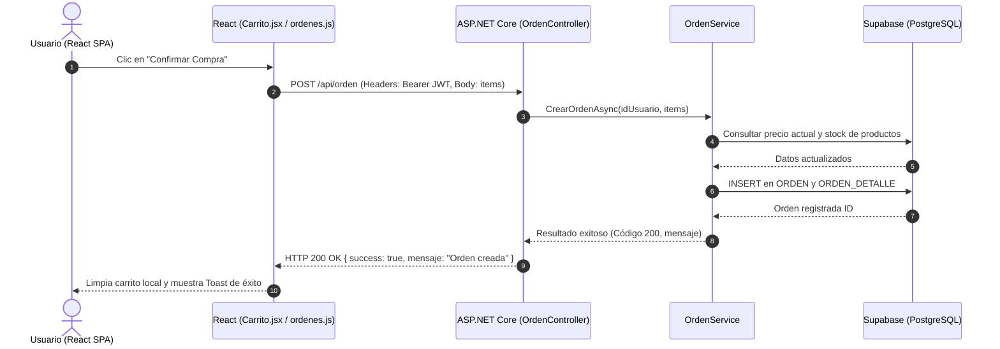

# Diagrama de Componentes y Comunicación

Este documento describe la arquitectura de componentes y la interacción entre el frontend en React y el backend en ASP.NET Core del sistema **Huellitas Vitales**. Para consultar los lineamientos generales del proyecto, véase [[Reglas-Generales]].

---

## 1. Visión General de Arquitectura y Comunicación

La comunicación entre la aplicación cliente y el servidor backend se realiza de manera asíncrona a través de una **API RESTful** sobre HTTP/HTTPS utilizando JSON como formato de intercambio de datos.

```
+-----------------------------------------------------------------------+
|                         NAVEGADOR (CLIENTE)                           |
|  +-----------------------------------------------------------------+  |
|  |                 React SPA (huellitas-frontend)                   |  |
|  |  [ React Pages / Components ] <-> [ Custom Hooks / API Fetch ] |  |
|  +-----------------------------------------------------------------+  |
+-----------------------------------||----------------------------------+
                                    || HTTP REST (JSON)
                                    || Auth: Bearer <JWT>
                                    \/
+-----------------------------------------------------------------------+
|                      SERVIDOR BACKEND (API REST)                      |
|  +-----------------------------------------------------------------+  |
|  |             ASP.NET Core API (HuellasVitalesAPI)                |  |
|  |                                                                 |  |
|  |  [ Controllers ] -> [ Services ] -> [ EF Core DbContext ]      |  |
|  +-----------------------------------------------------------------+  |
+-----------------------------------||----------------------------------+
                                    || Npgsql Driver
                                    \/
+-----------------------------------------------------------------------+
|                        BASE DE DATOS EN LA NUBE                       |
|  PostgreSQL (Supabase)                                                |
+-----------------------------------------------------------------------+
```

---

## 2. Mecanismo de Interacción y Autenticación

* **Base URL de la API:** Definida por la variable de entorno `VITE_API_URL` (ej. `http://localhost:5010/api`) y consumida desde `src/api/config.js`.
* **Seguridad y Tokens:**
  * La autenticación utiliza **JWT (JSON Web Token)**.
  * Al iniciar sesión o registrarse, el token es retornado y guardado en `localStorage` bajo la clave `token_huellitas`.
  * Las peticiones protegidas incluyen el encabezado HTTP:
    ```http
    Authorization: Bearer <token_huellitas>
    ```
* **CORS:** El backend posee la política de CORS `PermitirFrontend` en `Program.cs` permitiendo llamadas desde `http://localhost:5173` y los dominios de producción en Vercel.

---

## 3. Formato Estándar de Respuestas (JSON)

El backend responde consistentemente utilizando objetos JSON estandarizados para facilitar su procesamiento en los componentes de React.

### Respuesta de Éxito (HTTP 200 / 201)
```json
{
  "success": true,
  "mensaje": "Operación realizada con éxito.",
  "data": { ... }
}
```

### Respuesta de Error (HTTP 400 / 401 / 403 / 404 / 500)
```json
{
  "success": false,
  "mensaje": "Descripción legible del error en español."
}
```

---

## 4. Endpoints Consumidos por el Frontend

A continuación se detallan los principales endpoints organizados por módulo y su correspondiente controlador backend.

### Autenticación y Registro (`/api/login`)
* `POST /api/login/local` — Inicia sesión con correo y contraseña.
* `POST /api/login/registrar` — Registra un nuevo usuario cliente.
* `POST /api/login/google` — Autenticación rápida mediante Google OAuth.
* `POST /api/login/facebook` — Autenticación mediante Facebook.

### Usuarios y Perfil (`/api/usuario` y `/api/password`)
* `GET /api/usuario/perfil` 🔒 — Perfil del usuario autenticado (incluye `avatarIcono` y `tieneContrasena`, sin exponer `PasswordHash`).
* `PUT /api/usuario/perfil` 🔒 — Actualiza los datos del perfil (requiere token).
* `PUT /api/usuario/avatar` 🔒 — Cambia el ícono de perfil predefinido; el `icono` recibido se valida contra `UsuarioService.IconosPerfilValidos` (lista blanca, nunca un valor libre).
* `PUT /api/usuario/password` 🔒 — Cambia la contraseña del usuario autenticado. Si la cuenta ya tiene una contraseña local, exige y verifica `passwordActual`; si se registró solo con Google/Facebook y todavía no tiene ninguna, la establece directamente.
* `GET /api/usuario/proveedores-vinculados` 🔒 — Indica si la cuenta tiene Google y/o Facebook vinculados (`{ google, facebook }`), consultando `USUARIO_PROVEEDOR_AUTH`.
* `POST /api/usuario/vincular-google` / `vincular-facebook` 🔒 — Vincula la cuenta autenticada con Google/Facebook a partir de un credential/ID token (Google) o access token (Facebook); exige que el correo de la cuenta social coincida con `USUARIO.Correo` y que ese proveedor no esté ya vinculado a otro usuario.
* `POST /api/usuario/vincular-google-token` 🔒 — Igual que `vincular-google`, pero a partir de un access token del flujo implícito (`useGoogleLogin`) en vez de un credential/ID token; valida el token contra el endpoint `userinfo` de Google. Lo usa el switch de Google en Configuración, que no puede disparar el botón/iframe de `<GoogleLogin>` de forma programática.
* `DELETE /api/usuario/proveedores-vinculados/{proveedor}` 🔒 — Desvincula Google o Facebook de la cuenta autenticada. Rechaza la operación si dejaría al usuario sin ninguna forma de volver a entrar (sin contraseña local y sin otro proveedor vinculado).

#### Panel de Administración — gestión de cualquier usuario (`/api/usuario`, 🔒 Admin)
* `GET /api/usuario` — lista todos los usuarios de la plataforma, con filtros opcionales `?rol=&estado=&busqueda=` (busca por nombre/apellidos/correo).
* `POST /api/usuario` — el admin crea una cuenta nueva con el rol que elija (a diferencia del auto-registro, que siempre entra como Cliente).
* `GET /api/usuario/{id}` — detalle de un usuario puntual.
* `PUT /api/usuario/{id}` — edita nombre/apellidos/correo/teléfono de cualquier usuario.
* `PUT /api/usuario/{id}/rol` — reasigna el rol; rechaza quitarle el rol de Admin al único administrador activo de la plataforma.
* `PUT /api/usuario/{id}/estado` — activa/suspende la cuenta (`IdEstadoCuenta`) — es el "Eliminar" del panel de Usuarios, nunca hay borrado físico de un `USUARIO`. Al suspender (`IdEstadoCuenta = 3`) también se desactivan en cascada (`MASCOTA.Activo = false`) todas las mascotas de ese usuario — mismo criterio de borrado lógico, no se borran físicamente. Reactivar la cuenta no reactiva las mascotas automáticamente.
* `GET /api/usuario/estadisticas` — `{ total, activos, profesionales, administradores, porRol, porEstado }`, contado en vivo. `porRol`/`porEstado` alimentan las donas del Dashboard.
* `GET /api/usuario/estadisticas/registros?periodo=semanal|mensual|anual` — serie de tiempo de registros de usuarios (`{ etiqueta, cantidad }[]`), agrupada en memoria (no en SQL, para no depender de datos de cultura que podrían faltar en el contenedor de despliegue). Alimenta el gráfico de barras principal del Dashboard.

### Panel de Administración — vistas de plataforma completa (`/api/admin`, 🔒 Admin)
* `GET /api/admin/mascotas` — todas las mascotas de la plataforma + su dueño, filtro opcional `?busqueda=`.
* `POST /api/admin/mascotas` — el admin registra una mascota a nombre de cualquier usuario existente (`idUsuario` va en el body, no se resuelve del JWT). Reutiliza el mismo criterio de alta que `UsuarioService.CrearMascotaAsync`.
* `DELETE /api/admin/mascotas/{id}` — el admin da de baja la mascota de cualquier cliente (borrado lógico, `Activo = false`), sin la restricción de dueño que sí aplica `UsuarioService.EliminarMascotaAsync` (usada por el propio cliente para las suyas).
* `GET /api/admin/citas` — todas las citas de la plataforma (cualquier veterinaria), filtros opcionales `?estado=&idComercio=&desde=&hasta=`. La acción de cancelar reutiliza `PUT /api/cita/{id}/cancelar`, que ya acepta al rol Admin como autorizado sobre cualquier cita.
* `GET /api/admin/citas/estadisticas` — conteo de citas por estado (`{ pendientes, confirmadas, canceladas, completadas }`), para el gráfico de barras de Citas del Dashboard.

### Dashboard del panel de Administración
La sección "Dashboard" (antes apuntaba por error a la misma vista que "Usuarios" — enlace corregido en `DashboardAdmin.jsx`) combina, todo con datos reales: `GET /api/usuario/estadisticas` + `/estadisticas/registros` (con selector de período), `GET /api/reporte/resumen` (actividad clínica: citas, emergencias, atenciones externas, traslados — ya existía, reutilizado tal cual), `GET /api/admin/citas/estadisticas`, y el conteo de `GET /api/Comercio/pendientes`. Los gráficos (`components/Admin/Charts/BarraChart.jsx` y `DonaChart.jsx`) son CSS puro (barras con altura proporcional, donas con `conic-gradient`) — sin ninguna librería externa de gráficos.
* `POST /api/password/recuperar` — Genera un token de restablecimiento (flujo de contraseña olvidada, sin sesión). Actualmente el token se devuelve directo en la respuesta en vez de enviarse por correo (ver [[MEJORAS]]).
* `POST /api/password/restablecer` — Confirma el cambio de contraseña con ese token.

### Comercio y Solicitudes (`/api/comercio`)
* `POST /api/comercio/solicitud` — Envía una solicitud para afiliar una veterinaria o comercio.
* `GET /api/comercio/buscar` — Búsqueda y filtrado de comercios registrados (solo aprobados, para el marketplace).
* `GET /api/comercio/pendientes` 🔒 Admin — Lista solicitudes pendientes de aprobación.
* `PUT /api/comercio/{id}/aprobar` 🔒 Admin — Aprueba una solicitud de comercio.
* `PUT /api/comercio/{id}/rechazar` 🔒 Admin — Rechaza una solicitud de comercio (solo si sigue pendiente).
* `GET /api/comercio?estado=&busqueda=` 🔒 Admin — Lista **todos** los comercios de la plataforma, en cualquier estado (pendiente/aprobado/rechazado). Alimenta la pestaña "Todos los comercios" de la sección Comercios del panel Admin (antes "Solicitudes").
* `PUT /api/comercio/{id}` 🔒 Admin — Edita los datos básicos de cualquier comercio (nombre comercial, tipo, dirección, teléfono), sin importar su estado.
* `DELETE /api/comercio/{id}` 🔒 Admin — Elimina (da de baja) un comercio ya aprobado: reutiliza el estado Rechazado(3) — el proyecto no modela un estado "Desactivado" propio — lo que en la práctica ya lo saca del marketplace. A diferencia de `.../rechazar`, no exige que la solicitud siga pendiente.

### Marketplace, Productos y Servicios (`/api/marketplace`, `/api/producto`, `/api/servicio`, `/api/tiposervicio`)
* `GET /api/marketplace/catalogo` — Retorna el catálogo completo de productos y servicios disponibles.
* `GET /api/marketplace/buscar` — Búsqueda avanzada de productos con filtros y paginación.
* `POST /api/producto` 🔒 Comercio — Creación e inventario de un nuevo producto.
* `POST /api/servicio` 🔒 Admin/Funcionario — Registro de un nuevo servicio veterinario. Exige `IdVeterinario`, validado contra el mismo `IdComercio` del servicio (ver [[Modelo-Datos]] § VETERINARIO).
* `PUT /api/servicio/{id}` 🔒 Admin/Funcionario — Edita un servicio (incluye reactivarlo).
* `DELETE /api/servicio/{id}` 🔒 Admin/Funcionario — Desactiva un servicio (borrado lógico; nunca hay borrado físico).
* `GET /api/servicio/comercio/{idComercio}` — Lista todos los servicios (activos e inactivos) de una veterinaria.
* `GET /api/servicio/mis-veterinarias` / `GET /api/servicio/veterinarias-lista` 🔒 — Resuelven qué veterinaria(s) gestiona el usuario autenticado (funcionario) o todas las aprobadas (admin), para el selector del panel.
* `GET /api/servicio/veterinarios-comercio/{idComercio}` 🔒 — Veterinarios que ejercen en esa veterinaria puntual, para el selector de "veterinario que atiende" al crear/editar un servicio.
* `GET /api/tiposervicio` — Catálogo de tipos de servicio (Consulta, Grooming, Procedimiento, …), usado también por el filtro del Marketplace.
* `POST /api/tiposervicio` 🔒 Admin — Crea un nuevo tipo de servicio directamente (ya aprobado). El Funcionario ya no puede crear directo: debe solicitar (ver abajo).
* `PUT /api/tiposervicio/{id}/estado` 🔒 Admin — Activa/desactiva un tipo de servicio.
* `POST /api/tiposervicio/solicitar` 🔒 Funcionario — Solicita un tipo de servicio nuevo desde su veterinaria; queda `Pendiente` hasta que un Admin la resuelva.
* `GET /api/tiposervicio/solicitudes/pendientes` 🔒 Admin — Lista las solicitudes sin resolver.
* `GET /api/tiposervicio/solicitudes/mias` 🔒 — El Funcionario ve el estado de lo que él mismo solicitó (Pendiente/Aprobada/Rechazada).
* `PUT /api/tiposervicio/solicitudes/{id}/aprobar` 🔒 Admin — Aprueba la solicitud y crea el tipo en el catálogo.
* `PUT /api/tiposervicio/solicitudes/{id}/rechazar` 🔒 Admin — Rechaza la solicitud (no crea nada en el catálogo).

### Veterinarios (`/api/veterinario`)
* `GET /api/veterinario/buscar-usuario?correo=` 🔒 — Busca un usuario ya registrado por correo, para vincularlo como veterinario.
* `GET /api/veterinario/comercio/{idComercio}` 🔒 — Lista los veterinarios de una veterinaria puntual.
* `POST /api/veterinario` 🔒 Admin/Funcionario — Vincula un usuario existente como veterinario de una veterinaria. Admin puede hacerlo en cualquier veterinaria afiliada; Funcionario solo en la suya (mismo mecanismo de propiedad que `/api/servicio` y `/api/comerciofuncionario`). Si el usuario aún no tiene perfil de veterinario, lo crea; si ya es cliente, lo promueve a rol Veterinario. Rechaza vincular a un usuario que ya tenga rol Administrador o Funcionario (no se mezclan roles administrativos con el rol clínico).
* `DELETE /api/veterinario/{id}` 🔒 Admin/Funcionario — Desvincula al veterinario de la veterinaria (no borra su historial de servicios/citas).

### Empleados de Comercio (`/api/comerciofuncionario`)
* `GET /api/comerciofuncionario?idComercio=` 🔒 — Lista los empleados de un comercio puntual.
* `GET /api/comerciofuncionario/buscar-usuario?correo=` 🔒 — Busca un usuario ya registrado por correo, para vincularlo como empleado.
* `POST /api/comerciofuncionario` 🔒 — Vincula un usuario existente como empleado del comercio, con un cargo (`CARGO_CAT`). Rechaza vincular a un usuario que ya tenga rol Administrador o Funcionario (mismo criterio que `/api/veterinario`).
* `PUT /api/comerciofuncionario/{id}/estado` 🔒 — Activa/desactiva a un empleado (borrado lógico, nunca físico).
* Usado por `PanelEmpleados.jsx`, montado tanto en el panel de Administración como en el panel
  de Funcionario (`DashboardFuncionario.jsx`, pestaña "Empleados").
> **Limitación conocida:** la autorización de estos tres últimos endpoints (vía
> `ComercioValidacionService.ValidarPropietarioComercioAsync`) solo reconoce como dueño de un
> comercio al usuario que lo registró originalmente (`PersonaLegal.IdUsuario`) — nunca consulta
> `COMERCIO_FUNCIONARIO`. En la práctica, solo ese registrante original (promovido a rol
> Funcionario al aprobarse el comercio) puede gestionar empleados, productos o servicios; un
> empleado vinculado *a través de este mismo endpoint* no puede hacer nada con su propia cuenta
> todavía — ver [[MEJORAS]] (Mejora-06).

### Carrito de Compras y Órdenes (`/api/carrito`, `/api/orden`)
* `POST /api/carrito/agregar` 🔒 — Añade un ítem al carrito persistido en servidor.
* `POST /api/orden` 🔒 — Genera una orden de compra a partir de los ítems del carrito local/remoto reevaluando precios en el backend. Acepta el método de pago simulado elegido en el checkout (`MetodoPago`).
* `GET /api/orden` 🔒 — "Mis compras": historial de órdenes del usuario autenticado.
* `GET /api/orden/{id}` 🔒 — Recibo/factura interna de una orden puntual del usuario autenticado.

### Citas y Agenda (`/api/cita`, `/api/agenda`)
* `POST /api/cita/solicitar` 🔒 — Agenda una cita médica veterinaria.
* `GET /api/agenda/veterinario/{id}` 🔒 — Obtiene la agenda de citas programadas para un veterinario.
* `GET /api/cita/veterinario` 🔒 Veterinario — Agenda completa del veterinario autenticado (usada por `AgendaDiariaVeterinario.jsx` y el panel clínico de `PanelVeterinario.jsx`).
* `PUT /api/cita/{id}/confirmar` / `/reprogramar` / `/cancelar` 🔒 — Ciclo de vida de una cita.
* `PUT /api/cita/{id}/completar` 🔒 — Marca la cita como completada y agrega una nota clínica opcional (reutiliza la columna `CITA.Notas`). Solo el veterinario a cargo o un Admin; no se puede completar una cita cancelada ni ya completada.

### Expedientes Clínicos (`/api/expediente`)
* `GET /api/expediente/mascota/{idMascota}` 🔒 — Obtiene el expediente de una mascota, creándolo automáticamente si no existe y la mascota ya tuvo alguna cita (resuelve la veterinaria vía `CITA → SERVICIO → COMERCIO`). Si nunca tuvo cita, responde 404 invitando a agendar o a abrir el expediente por otra vía.
* `POST /api/expediente/abrir` 🔒 — Abre el expediente de una mascota sin cita previa, eligiendo una veterinaria puntual (usado por Emergencia/Traslado cuando el cliente prefiere avisarle a una clínica específica).
* `POST /api/expediente/abrir-sin-veterinaria` 🔒 — Abre el expediente sin elegir ninguna veterinaria (`IdComercioActual = NULL`); usado por Atenciones Externas, que por definición no tiene relación con ninguna veterinaria de la plataforma.
* `GET /api/expediente/{idExpediente}` 🔒 — Detalle completo (mascota, veterinaria actual, historial de comercios, atenciones externas, emergencias). Acceso: dueño de la mascota, Admin, o veterinaria con fila vigente en `EXPEDIENTE_COMERCIO` (ver [[Modelo-Datos]] § EXPEDIENTE_COMERCIO).
* `GET /api/expediente/{idExpediente}/exportar-pdf` 🔒 — Genera y descarga el expediente en PDF (QuestPDF), mismo control de acceso que el detalle.

### Traslado de Expediente (`/api/trasladoexpediente`)
* `POST /api/trasladoexpediente/expedientes/{idExpediente}/solicitudes` 🔒 Cliente — Solicita trasladar el expediente a otra veterinaria. Requiere que el expediente ya tenga una veterinaria actual (400 si no) y que no exista ya una solicitud `Pendiente` para ese expediente.
* `PUT /api/trasladoexpediente/solicitudes/{id}/aceptar` / `/rechazar` 🔒 Veterinaria destino/Admin — Resuelve la solicitud; al aceptar, transfiere el acceso vigente en `EXPEDIENTE_COMERCIO` y actualiza `EXPEDIENTE.IdComercioActual` dentro de una transacción.
* `GET /api/trasladoexpediente/solicitudes/pendientes` 🔒 — Solicitudes pendientes dirigidas a las veterinarias que administra el usuario (o todas, si es Admin).
* `GET /api/trasladoexpediente/mis-solicitudes` 🔒 Cliente — Historial de las solicitudes que el propio cliente envió, con su estado y respuesta.

### Atenciones Externas (`/api/expedientes/{idExpediente}/atenciones-externas`)
* `GET` 🔒 — Lista las atenciones externas registradas en un expediente, con sus documentos adjuntos.
* `POST` 🔒 Cliente — Registra una consulta que le hicieron a la mascota fuera de Huellitas Vitales (veterinaria/profesional en texto libre, motivo, diagnóstico, tratamiento).
* `POST /{idAtencionExterna}/documentos` 🔒 Cliente — Adjunta un comprobante (PDF/imagen) a una atención externa; se guarda en `wwwroot/uploads/atenciones-externas/`.

### Emergencias (`/api/expedientes/{idExpediente}/emergencias`, `/api/emergencias`, `/api/comercios/{id}/veterinarios-disponibles`)
* `POST /api/expedientes/{idExpediente}/emergencias` 🔒 Cliente — Solicita atención de emergencia. Si el cuerpo no incluye `idComercio`, se manda en **broadcast** a todas las veterinarias aprobadas; si lo incluye, solo se notifica a esa veterinaria puntual (ver [[Modelo-Datos]] § EMERGENCIA). El teléfono de contacto no viaja en el body: se autocompleta y persiste en `USUARIO.Telefono` desde el propio formulario del cliente.
* `GET /api/expedientes/{idExpediente}/emergencias` 🔒 — Lista las emergencias de un expediente puntual.
* `PUT /{id}/aceptar` 🔒 Veterinario/Admin — Acepta la emergencia; si era broadcast (`IdComercio = NULL`), queda "reclamada" por el comercio de quien acepta.
* `PUT /{id}/iniciar` / `/finalizar` 🔒 Veterinario/Admin — Avanza el ciclo de vida (`Aceptada → EnAtencion → Finalizada`), `finalizar` exige diagnóstico y tratamiento.
* `PUT /{id}/atencion-externa` 🔒 Cliente — El propio solicitante cierra la emergencia registrando que lo atendieron fuera de la plataforma (sin adjuntar documentos, a diferencia de Atenciones Externas).
* `GET /api/emergencias/pendientes` 🔒 — Emergencias pendientes: dirigidas a la veterinaria del usuario, más las de broadcast si es Veterinario, Admin, o funcionario/dueño de una veterinaria.
* `GET /api/emergencias/en-curso` 🔒 — Emergencias que el veterinario autenticado tiene aceptadas (o todas, si es Admin).
* `GET /api/emergencias/mis-emergencias` 🔒 Cliente — Historial completo de emergencias del cliente, de **todas** sus mascotas (no solo la seleccionada en el momento).
* `GET /api/comercios/{idComercio}/veterinarios-disponibles` 🔒 — Veterinarios de esa veterinaria y si alguno está dentro de su horario ahora mismo (banner de disponibilidad en el formulario de emergencia).

### Notificaciones (`/api/notificacion`)
* `GET /api/notificacion` 🔒 — Últimas 50 notificaciones del usuario autenticado (leídas y no leídas), con las no leídas primero y luego por fecha descendente (consumido por `NotificacionesBell.jsx`, la campanita compartida en todos los paneles, que además hace polling cada 60 segundos).
* `PUT /api/notificacion/{id}/leida` 🔒 — Marca una notificación como leída.
* Al hacer clic en una notificación, el frontend la redirige a la sección relacionada según su `Tipo` y el rol del usuario: `"Emergencia"` → `/cliente/emergencia` (cliente) o `/veterinario?vista=emergencias` / `/admin?seccion=emergencias` (veterinario/admin); `"TrasladoExpediente"` → `/cliente/trasladar-expediente` (cliente) o `?vista=traslados` / `?seccion=traslados` (veterinario/admin/funcionario). Los paneles con pestañas internas (`PanelVeterinario`, `DashboardAdmin`, `DashboardFuncionario`) leen ese query param al montar y también reaccionan si ya están abiertos.

### Reportes (`/api/reporte`)
* `GET /api/reporte/resumen` — Se ramifica por rol: Cliente recibe conteos de sus propias mascotas (citas, atenciones externas, emergencias); Veterinario/Admin reciben el resumen de su(s) veterinaria(s).
* `GET /api/reporte/historial-clinico` 🔒 Cliente — Timeline real (no inventado) por mascota: une citas completadas + atenciones externas + emergencias finalizadas, ordenado por fecha.

---

## 5. Diagrama de Secuencia de Ejemplo: Flujo de Compra / Orden


